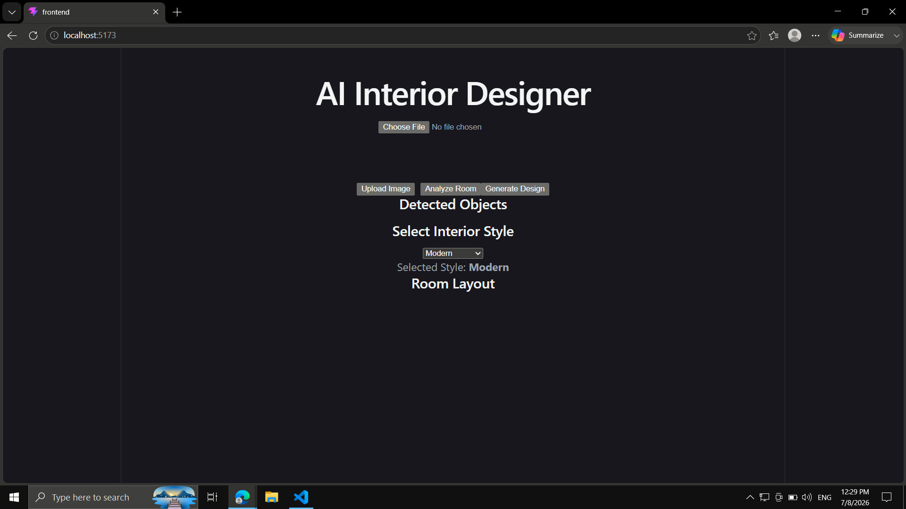
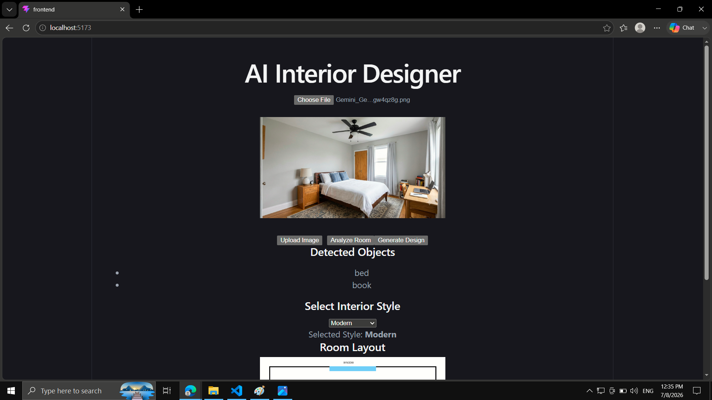
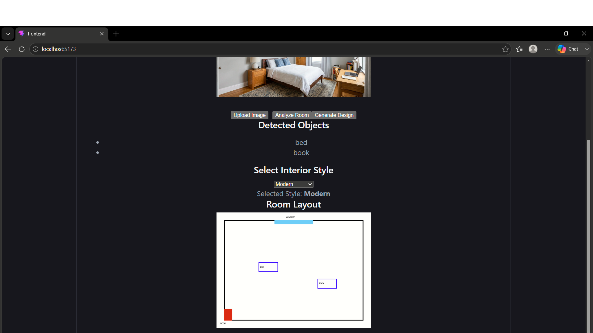
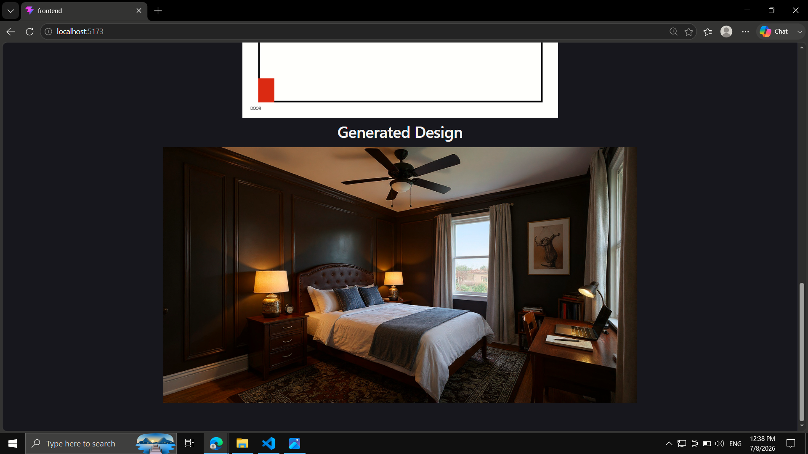

# 🏠 AI Interior Designer

An AI-powered Interior Design application that analyzes room images, detects furniture using Computer Vision, generates a top-view room layout, and redesigns interiors using Generative AI while preserving the original room structure.

---

# ✨ Features

# 📸 Screenshots

## Home Page



---

## Room Analysis



---

## Room Layout



---

## AI Generated Design


- 📷 Upload room images
- 🪑 Detect furniture using YOLOv8
- 🗺 Generate top-view room layout
- 🎨 Select interior design style
- 🤖 Generate AI redesigned room
- ⚡ FastAPI backend
- ⚛ React frontend

---

# 🛠 Tech Stack

## Frontend
- React
- Vite
- JavaScript

## Backend
- FastAPI
- Python

## AI
- YOLOv8
- Replicate API

## Libraries
- OpenCV
- Ultralytics
- Matplotlib

## Tools
- Git
- GitHub
- VS Code

---

# 🏗 Architecture

```
User
   │
   ▼
React Frontend
   │
   ▼
FastAPI Backend
   │
   ├── Upload Image
   ├── Object Detection
   ├── Layout Generation
   └── AI Image Generation
              │
              ▼
        Replicate AI
              │
              ▼
      Redesigned Interior
```

---

# 📁 Folder Structure

```
AI-Interior-Designer
│
├── backend
│   ├── ai
│   ├── services
│   ├── uploads
│   ├── layouts
│   ├── main.py
│   └── requirements.txt
│
├── frontend
│   ├── src
│   ├── public
│   └── package.json
│
├── .gitignore
└── README.md
```

---

# 🚀 Installation

## Clone Repository

```bash
git clone https://github.com/Kishore2K04/AI-Interior-Designer.git
```

## Backend

```bash
cd backend

python -m venv .venv

pip install -r requirements.txt

uvicorn main:app --reload
```

## Frontend

```bash
cd frontend

npm install

npm run dev
```

---

# 📖 Usage

1. Upload a room image.
2. Analyze the room.
3. View detected furniture.
4. View generated room layout.
5. Select an interior style.
6. Generate an AI redesigned room.

---

# 📌 Version 1 Features

- Image Upload
- Object Detection
- Room Analysis
- Layout Generation
- Style Selection
- AI Interior Generation

---

# 🚧 Current Limitations

- Simplified room layout
- Limited room understanding
- Best suited for single-room images
- AI generation depends on external API

---

# 🚀 Roadmap (Version 2)

- Better room understanding
- Wall detection
- Door detection
- Window detection
- Exact furniture placement
- Multiple design options
- HD image generation
- Save project history
- Cloud deployment

---

# 📄 License

MIT License

---


## 👨‍💻 Author

Developed by **Kishore S**

Computer Science Engineering Student

AI & Full-Stack Developer